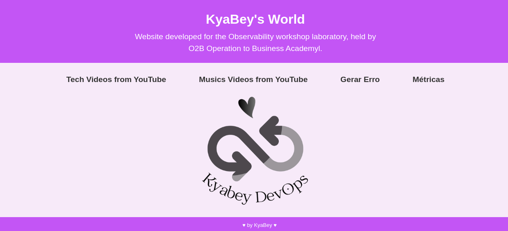
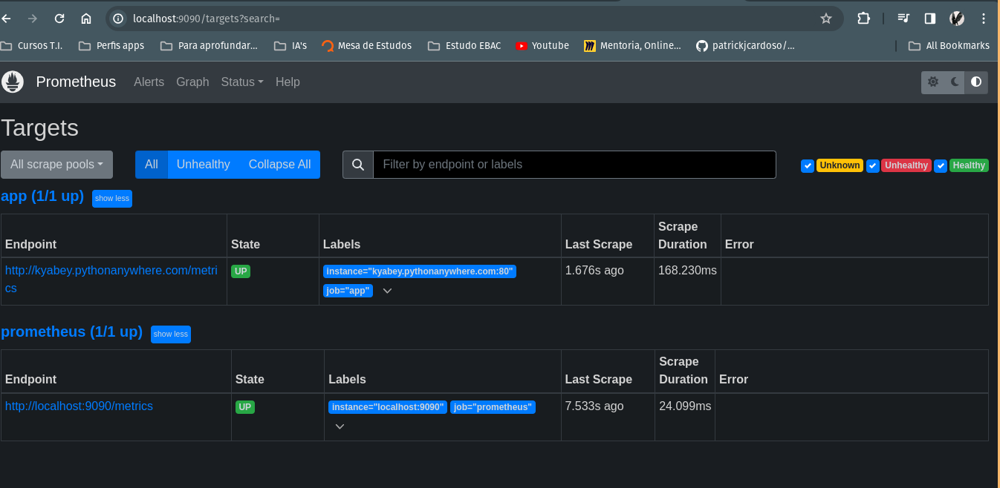
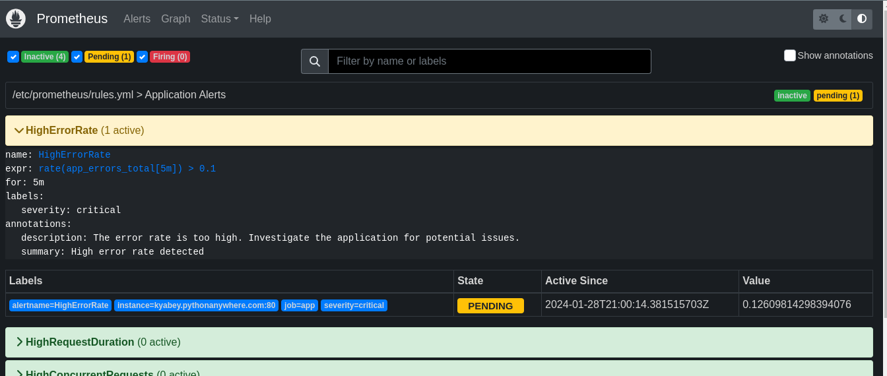
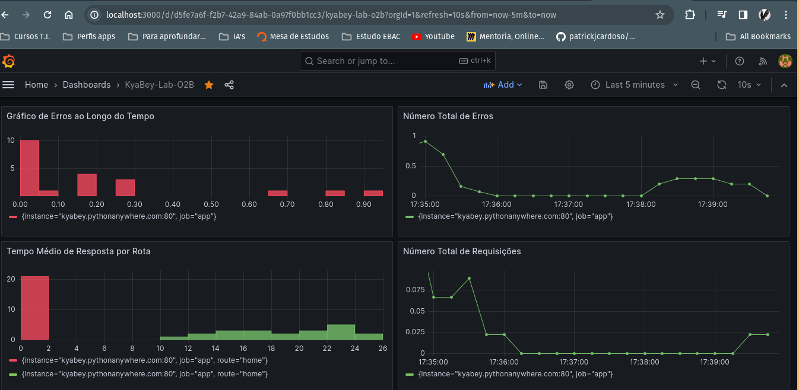
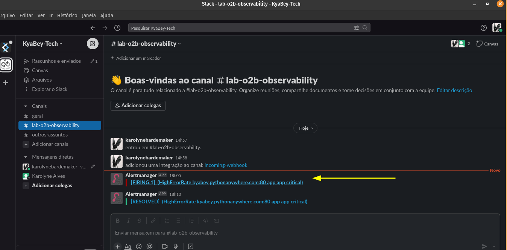

<h1 align="center">
   
  Lab-O2B-Observability
   
</h1>

Olá! Esse é meu Lab do workshop sobre Observabilidade oferecido pela O2B Academy, com base no desafio proposto pelo professor Patrick Cardoso (https://github.com/patrickjcardoso/desafio_o11y), elaborei um projeto (com a ajudinha do ChatGPT) onde disponibilizo em uma web page conteúdos de tecnologia e música, trazidos direto de duas playlists do meu canal no Youtube. Este laboratório tem a pretensão de utilizar a observabilidade e o monitoramento da minha aplicação, proporcionando uma experiência de controle e prevenção. Utilizando Prometheus e Grafana, o projeto coleta e visualiza métricas relacionadas ao desempenho da aplicação, taxas de erro e outros pontos de dados relevantes.

<h2 align="center">Funcionalidades 🚀</h2>

- **Integração com a API do YouTube:** O projeto interage com a API do YouTube usando uma chave de API fornecida para obter informações sobre vídeos em listas de reprodução específicas.

- **Aplicação Web Flask:** Lab-O2B-Observability é construído usando o framework web Flask, proporcionando uma interface de usuário simples e intuitiva para explorar playlists e gerar erros intencionais.

- **Métricas do Prometheus:** A aplicação expõe métricas relacionadas a contagens de requisições, contagens de erros e duração de requisições em um formato adequado para o monitoramento do Prometheus.

- **Dashboard Grafana:** O projeto inclui o Grafana para visualizar métricas do Prometheus, permitindo que os usuários obtenham insights sobre o desempenho da aplicação e taxas de erro.

<h2 align="center">Dependências 📦</h2>

### Pacotes Python 🐍
- `dotenv`: Gerencia variáveis de ambiente.
- `flask`: Framework web para construir a aplicação.
- `prometheus_client`: Fornece integração de métricas do Prometheus.
- `googleapiclient`: Possibilita a comunicação com a API do YouTube.

### Serviços Externos 🌐
- **Chave da API do YouTube:** Obtenha uma chave da API do YouTube e defina-a como a variável de ambiente `YOUTUBE_API_KEY`.

<h2 align="center">Etapas 🚗</h2>

### Configurando o Ambiente 🌐

### Executando a Aplicação Flask 🚀

-  Executei a aplicação no pythonanywhere

### Executando o Prometheus e Grafana 🐳

- Com o Docker instalado iniciei os containers do Prometheus e Grafana

### Acessando a Aplicação 🌐

- Aplicação Flask: https://kyabey.pythonanywhere.com/
- Prometheus: e Grafana o acesso foi local.

<h2 align="center">Como Uso Meu APP 🚀</h2>

1. Exploro minhas playlists de tecnologia e música prediletas.
2. Gero erros intencionais visitando `/generate-error` em meu navegador para monitorar as métricas da aplicação no Grafana.

<h2 align="center">Estrutura do Projeto 📂</h2>

- `python-app/app.py`: Arquivo principal da aplicação Flask.
- `python-app/static/*`: Arquivos (script.js, style.css, imagem.png).
- `python-app/templates/*`: Arquivos (home.html, index.html, playlists.html).
- `prometheus/prometheus.yml`: Arquivo de configuração para o Prometheus.
- `alertmanager.yml`: Arquivo de configuração para o Alertmanager.
- `docker-compose.yml`: Arquivo Docker Compose para configurar Prometheus e Grafana.
- `rules.yml`: Arquivos regras para alertas.

<h2 align="center">Capturas de Tela 📸</h2>

### Painel do Prometheus

### Painel do Grafana

### Alertas no Slack

<h2 align="center">Por Que Lab-O2B-Observability? 🤔</h2>

Lab-O2B-Observability é essencial para obter insights sobre o desempenho da aplicação, identificar possíveis problemas e garantir uma experiência de usuário fluida. Ao utilizar Prometheus e Grafana, o projeto oferece uma solução robusta de monitoramento que capacita desenvolvedores e operadores a tomar decisões informadas e manter uma experiência confiável na entrega de suas aplicações. 🌐🚀
